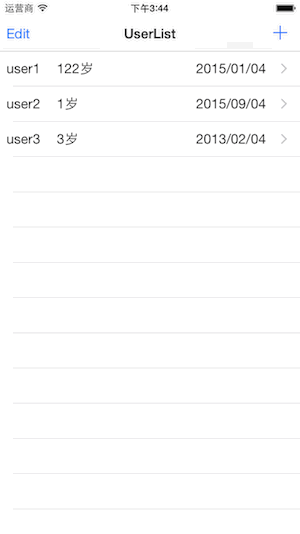

### 说明

这是一个使用MagicalRecord实现CRUD操作的例子.

具体的介绍可以参考我的博客文章：[在iOS项目中使用MagicalRecord](http://makeiteasy.github.io/2015/02/04/use-magicalrecord-with-coredata.html)

### 使用到的知识点

* MagicalRecord
* NSFetchedResultController

### 关于运行

因为该项目使用了cocoapods来进行包管理，所以如果希望下载运行的话，需要实现安装[cocoapods](http://cocoapods.org)，
然后在项目根目录下运行`pod install`，执行成功后打开`MagicalRecordExample.xcworkspace`文件编译运行即可。
